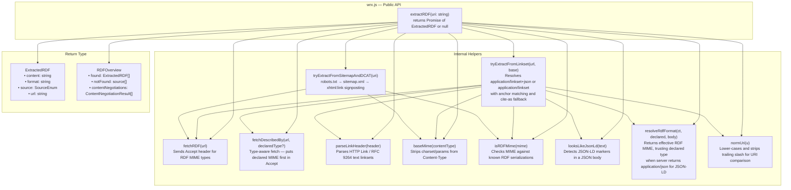
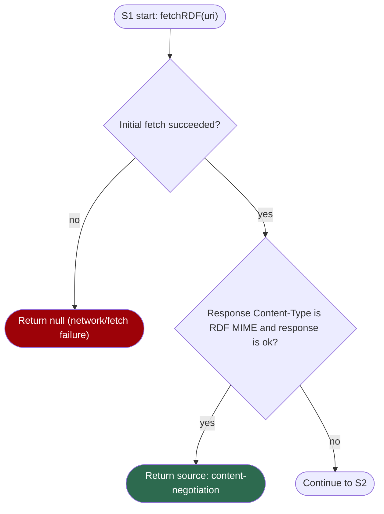
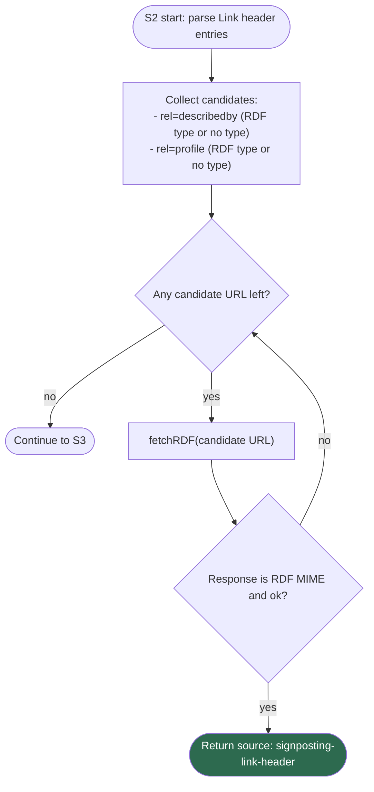
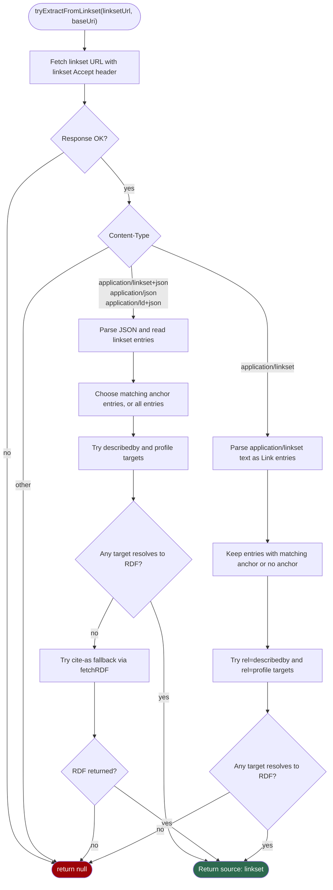
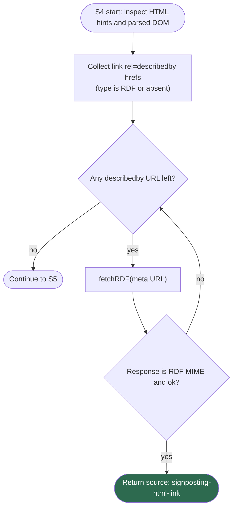
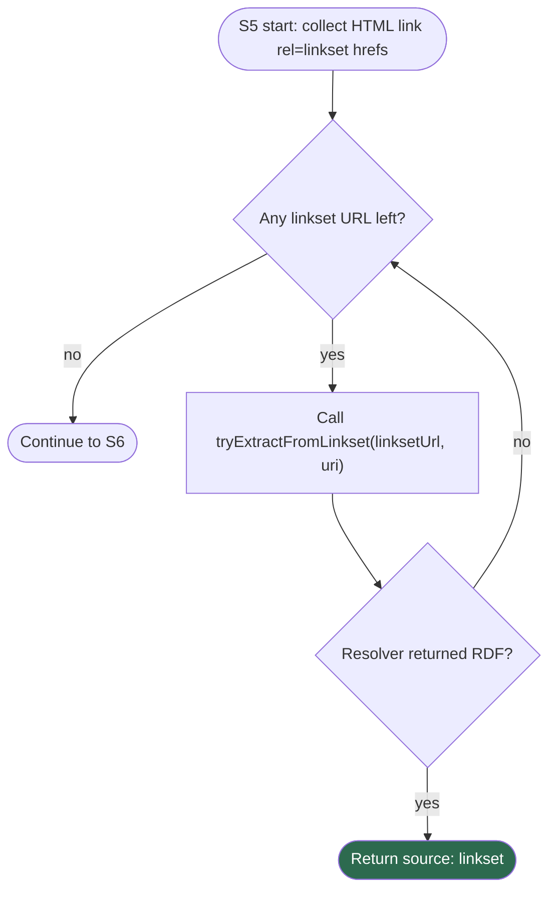
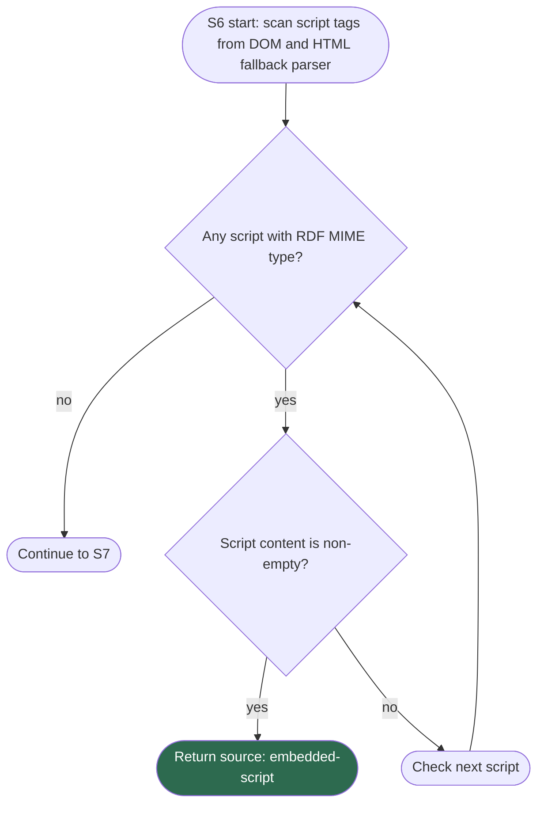
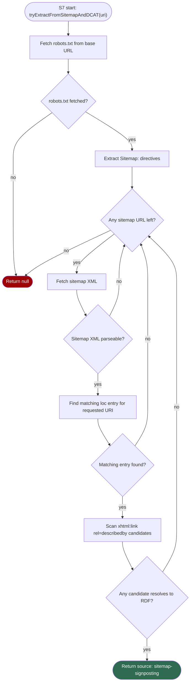

# wrx.js — Web Resource Extraction Documentation

## Overview

`wrx.js` is a zero-dependency Bun/TypeScript module for web resource extraction from any URI. It retrieves RDF metadata using a **cascading strategy**: each discovery step is tried in priority order and the first successful result is immediately returned. The module never requires external npm packages — it uses only Bun's built-in `fetch`, `URL`, and `DOMParser`.

---

## Reference specifications

- [RFC 8288 — Web Linking](https://www.rfc-editor.org/rfc/rfc8288.html)
- [RFC 6906 — Profile Link Relation](https://www.rfc-editor.org/rfc/rfc6906.html)
- [RFC 9264 — Linkset](https://www.rfc-editor.org/rfc/rfc9264.html)
- [RFC 5785 — Well-Known URIs](https://www.rfc-editor.org/rfc/rfc5785.html)
- [RFC 9727 — API Catalog](https://www.rfc-editor.org/rfc/rfc9727.html)
- [RFC 7284 — Profile URI Registry](https://www.rfc-editor.org/rfc/rfc7284.html)
- [RFC 9309 — Robots Exclusion Protocol](https://www.rfc-editor.org/rfc/rfc9309.html)
- [Sitemap Protocol](http://sitemaps.org/)

## Module Architecture



### Key Types

| Type / Constant | Purpose |
|---|---|
| `ExtractedRDF` | The result object returned on success |
| `RDFOverview` | Returned by `extractAllRDF()` — all hits + strategies that found nothing |
| `RDF_MIMES` | `Set<string>` of all recognised RDF MIME types |
| `RDF_ACCEPT` | The `Accept` header value sent during generic content negotiation |

#### `ExtractedRDF` interface

```typescript
interface ExtractedRDF {
  content: string;   // Raw RDF payload
  format:  string;   // MIME type (e.g. "text/turtle")
  source:            // Where it was found
    | 'content-negotiation'
    | 'signposting-link-header'
    | 'signposting-html-link'
    | 'embedded-script'
    | 'linkset'
    | 'sitemap-signposting';
  url: string;       // Final URL the RDF was fetched from
}
```

#### `RDFOverview` interface (returned by `extractAllRDF`)

```typescript
interface ContentNegotiationResult {
  requestedMime: string;  // MIME type sent in the Accept header
  responseMime:  string;  // Content-Type returned by the server
  chars:         number;  // Length of the response body
  isRdf:         boolean; // Whether the response is a known RDF serialization
  url:           string;  // Request URL
}

interface StrategyTraceStep {
  strategy: number; // 1-based strategy index in the paper flow
  source:   ExtractedRDF['source'];
  label:    string; // Human-readable strategy label
  found:    boolean;
  hits: Array<{
    format: string;
    url:    string;
    chars:  number;
  }>;
}

interface RDFOverview {
  found:                ExtractedRDF[];                    // All successful RDF hits
  notFound:             Array<ExtractedRDF['source']>;     // Strategies that yielded nothing
  contentNegotiations:  ContentNegotiationResult[];        // Per-MIME-type results for Strategy 1
  trace:                StrategyTraceStep[];               // Full ordered strategy trace
}
```

#### Supported RDF MIME types

| MIME type | Serialisation |
|---|---|
| `text/turtle` | Turtle |
| `application/ld+json` | JSON-LD |
| `application/rdf+xml` | RDF/XML |
| `application/n-triples` | N-Triples |
| `text/n3` | Notation3 |
| `application/n-quads` | N-Quads |
| `application/trig` | TriG |

---

## Extraction Strategy — Full Flowchart

The diagram below captures every decision branch inside `extractRDF()`.

```mermaid
flowchart LR
  subgraph STRATS["Strategies (in order)"]
    direction TB
    S0(["Start: extractRDF(uri)"])
    S1{"S1 Content negotiation\nRDF MIME returned?"}
    S2{"S2 HTTP Link describedby/profile\nAny target resolves to RDF?"}
    S3{"S3 Linkset resolution\nAny linkset target resolves to RDF?"}
    S4{"S4 HTML describedby\nAny target resolves to RDF?"}
    S5{"S5 HTML linkset\nAny linkset target resolves to RDF?"}
    S6{"S6 Embedded RDF script\nRDF script present?"}
    S7{"S7 Sitemap/DCAT fallback\nRDF found?"}
    S0 --> S1 -->|no| S2 -->|no| S3 -->|no| S4 -->|no| S5 -->|no| S6 -->|no| S7
  end

  subgraph OUT["Outcomes"]
    direction TB
    R1(["Return source: content-negotiation"])
    R2(["Return source: signposting-link-header"])
    R3(["Return source: linkset"])
    R4(["Return source: signposting-html-link"])
    R5(["Return source: linkset"])
    R6(["Return source: embedded-script"])
    R7(["Return source: sitemap-signposting"])
    R0(["Return null"])
  end

  S1 -->|yes| R1
  S2 -->|yes| R2
  S3 -->|yes| R3
  S4 -->|yes| R4
  S5 -->|yes| R5
  S6 -->|yes| R6
  S7 -->|yes| R7
  S7 -->|no| R0

  style R1 fill:#2d6a4f,color:#fff
  style R2 fill:#2d6a4f,color:#fff
  style R3 fill:#2d6a4f,color:#fff
  style R4 fill:#2d6a4f,color:#fff
  style R5 fill:#2d6a4f,color:#fff
  style R6 fill:#2d6a4f,color:#fff
  style R7 fill:#2d6a4f,color:#fff
  style R0 fill:#9d0208,color:#fff
```



---

## Strategy Deep Dives

The charts below expand each strategy from the main extraction flow.

### S1 — Content Negotiation



### S2 — HTTP Link Header DescribedBy/Profile



### S3 — Linkset Resolution (Header/Profile/URI Conneg)

This strategy reuses `tryExtractFromLinkset(linksetUrl, baseUri)`.



### S4 — HTML DescribedBy



### S5 — HTML Linkset

This strategy reuses the same linkset resolver from S3 and only changes discovery source.



### S6 — Embedded RDF Script



### S7 — Sitemap and DCAT Fallback



---

## Strategy Priority Table

| Priority | Strategy | Trigger condition | `source` value |
|:---:|---|---|---|
| 1 | **Content negotiation** | Server returns RDF MIME directly | `content-negotiation` |
| 2 | **HTTP Link header — describedby** | `Link: <…>; rel="describedby"` header with RDF type | `signposting-link-header` |
| 3 | **HTTP Link header — linkset** | `Link: <…>; rel="linkset"` → resolved linkset contains RDF | `linkset` |
| 4 | **HTML link — describedby** | `<link rel="describedby">` in HTML `<head>` | `signposting-html-link` |
| 5 | **HTML link — linkset** | `<link rel="linkset">` in HTML `<head>` → resolved linkset contains RDF | `linkset` |
| 6 | **Embedded script** | `<script type="application/ld+json">` (or other RDF MIME) in HTML body | `embedded-script` |
| 7 | **Sitemap signposting** | `robots.txt` → `sitemap.xml` → `<xhtml:link rel="describedby">` in matching `<url>` entry | `sitemap-signposting` |

---

## File Structure

```
wrx/
├── wrx.ts                # Core module — export extractRDF(), ExtractedRDF
├── wrx.js                # Public entrypoint wrapper
├── bun-globals.d.ts      # Ambient types for import.meta.main and process
├── package.json          # Bun project manifest
├── tsconfig.json         # TypeScript config (ESNext + DOM + DOM.Iterable libs)
├── DOCUMENTATION.md      # This file
└── README.md             # Project overview
```

---

## Usage

### As a library

```typescript
import { extractRDF, type ExtractedRDF } from './wrx.js';

const result: ExtractedRDF | null = await extractRDF('https://example.org/dataset');

if (result) {
  console.log(result.source);   // e.g. 'content-negotiation'
  console.log(result.format);   // e.g. 'text/turtle'
  console.log(result.url);      // resolved URL the RDF came from
  console.log(result.content);  // raw RDF string
} else {
  console.log('No RDF found.');
}
```

Install in another Bun project with:

```sh
bun add github:cedricdcc/wrx
```

### As a CLI tool — first-match mode

```sh
bun run wrx.js https://example.org/dataset
```

Example output:
```
🔍 Extracting RDF from: https://example.org/dataset
✅ Found RDF (content-negotiation) from https://example.org/dataset
Format: text/turtle
Content length: 4821 chars

--- First 500 chars of RDF ---
@prefix dcat: <http://www.w3.org/ns/dcat#> .
...
```

### As a CLI tool — `--all` mode (explore all paths)

Pass `--all` to run every extraction strategy and get a full overview of what is available for the resource, instead of stopping at the first success:

```sh
bun run wrx.js --all https://example.org/dataset
```

Example output:
```
🔍 Exploring all RDF paths for: https://example.org/dataset

  ✅ Strategy 1 — Content Negotiation (3 RDF format(s) found)
       Requested MIME                →  Response MIME                  Chars
       ──────────────────────────      ──────────────────────────      ─────
       text/turtle                   →  text/turtle                       4,821  ✅
       application/ld+json           →  application/ld+json               2,341  ✅
       application/rdf+xml           →  text/html                        15,234  ❌
       application/n-triples         →  application/n-triples             8,901  ✅
       text/n3                       →  text/turtle                       4,821  ✅ (duplicate format)
       application/n-quads           →  text/html                        15,234  ❌
  ✅ Strategy 2 — HTTP Link header (rel=describedby)
       text/turtle  https://example.org/dataset.ttl  (4821 chars)
  ❌ Strategy 3 — Linkset (rel=linkset)
  ❌ Strategy 4 — HTML link[rel=describedby]
  ✅ Strategy 5 — Embedded RDF script
       application/ld+json  https://example.org/dataset  (312 chars)
  ❌ Strategy 6 — Sitemap signposting (robots.txt)

📋 Content Negotiation Overview (all MIME types):
   text/turtle                →   4,821 chars  (text/turtle)             ✅ RDF
   application/ld+json        →   2,341 chars  (application/ld+json)     ✅ RDF
   application/rdf+xml        →  15,234 chars  (text/html)               ❌ not RDF
   application/n-triples      →   8,901 chars  (application/n-triples)   ✅ RDF
   text/n3                    →   4,821 chars  (text/turtle)             ✅ RDF
   application/n-quads        →  15,234 chars  (text/html)               ❌ not RDF

📊 3 unique RDF source(s) found across 6 strategies tried.
```

> **Note:** `text/n3` returned `text/turtle` in the example above, which is the same format as the first request. The `found` array deduplicates by response format, so both requests count in `contentNegotiations` but only one entry appears in `found`.

### As a library — `extractAllRDF`

```typescript
import { extractAllRDF, type RDFOverview } from './wrx.js';

const overview: RDFOverview = await extractAllRDF('https://example.org/dataset');

for (const rdf of overview.found) {
  console.log(rdf.source, rdf.format, rdf.url);
}
console.log('Not found via:', overview.notFound);

// Content negotiation details (one entry per MIME type tried)
for (const cn of overview.contentNegotiations) {
  console.log(`${cn.requestedMime} → ${cn.responseMime} (${cn.chars} chars) ${cn.isRdf ? '✅' : '❌'}`);
}
```

---

## Design Decisions

### Per-MIME-type content negotiation in `--all` mode
In the default `extractRDF()` mode, a single HTTP request is made with a combined `Accept` header listing all supported RDF MIME types. In `extractAllRDF()` (`--all` mode), each RDF MIME type is tried individually in its own HTTP request so that every possible server response is captured. Results are deduplicated (two requests returning the same format produce only one entry in `found`). Non-RDF responses are recorded in `contentNegotiations` with their character count, making it easy to see which MIME types the server does — and does not — support for the target resource.

### No external dependencies
The module relies exclusively on Bun built-ins (`fetch`, `URL`, `DOMParser`, `Response`). This keeps deployment simple — no `node_modules`, no `bun install` required at runtime.

### `baseMime()` helper
`Content-Type` headers can include parameters (e.g. `text/turtle; charset=utf-8`). The `baseMime()` helper strips these safely without using array indexing (which would trigger TypeScript's `noUncheckedIndexedAccess` warning).

### Graceful failure
Every network call is wrapped in `try/catch`. A failure in any step causes a fall-through to the next strategy rather than an exception — `null` is returned only when all strategies are exhausted.

### RFC 9264 linkset support
Both serialisations are supported:
- `application/linkset+json` — JSON format, checks `describedby` and `profile` relation arrays
- `application/linkset` — text format, treated as a Link header and parsed with `parseLinkHeader()`

### RFC 9264 anchor matching (InvenioRDM / Zenodo)
A linkset document may describe multiple resources (e.g. the landing page and each of its files). Per RFC 9264 §4.2, the entry whose `anchor` URI matches the requested URI should be preferred over the others. `normUri()` normalises both URIs (lowercase, strip trailing slash) before comparing, so `https://zenodo.org/records/42` and `https://zenodo.org/records/42/` are treated as equivalent. When no entry's anchor matches, all entries are iterated as a fallback to support servers that omit the `anchor` field.

### Type-aware `fetchDescribedBy()` (InvenioRDM / Zenodo)
InvenioRDM/Zenodo linkset entries declare a specific RDF type for their `describedby` targets (e.g. `"type": "application/ld+json"`). The `fetchDescribedBy()` helper builds an `Accept` header that places the declared MIME type at `q=1.0` and all other RDF types below it, maximising the chance the server returns the format it advertises without the consumer having to know the server's routing logic.

### JSON-LD trust via `resolveRdfFormat()` and `looksLikeJsonLd()`
Some InvenioRDM deployments return `Content-Type: application/json` even when the body is JSON-LD. `looksLikeJsonLd()` checks for JSON-LD structural markers (`@context`, `@type`, `@graph`) at the top level of the parsed body (including top-level arrays, which are valid JSON-LD). `resolveRdfFormat()` uses this to trust the linkset's declared MIME type in these cases, setting `format` to `application/ld+json` rather than `application/json`.

### `application/json` linkset body fallback
For the same reason, if a server returns `Content-Type: application/json` for the linkset request itself but the body contains a top-level `linkset` array, the body is parsed and processed as `application/linkset+json`.

### `cite-as` content-negotiation fallback
When a linkset entry's `describedby`/`profile` targets all fail to return RDF, the module tries RDF content negotiation on any `cite-as` URI in the same entry (typically a DOI). This catches cases where a DOI resolves with proper `Accept`-based negotiation even though the direct metadata URL is inaccessible.

### Trailing-slash normalisation
URI comparison in the sitemap strategy accepts `https://example.org/foo`, `https://example.org/foo/` and their reverse without requiring exact equality. The same `normUri()` helper is used for anchor matching in the linkset strategy.
