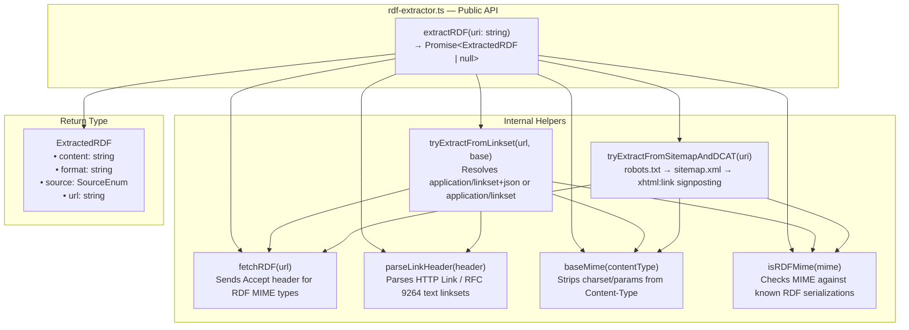
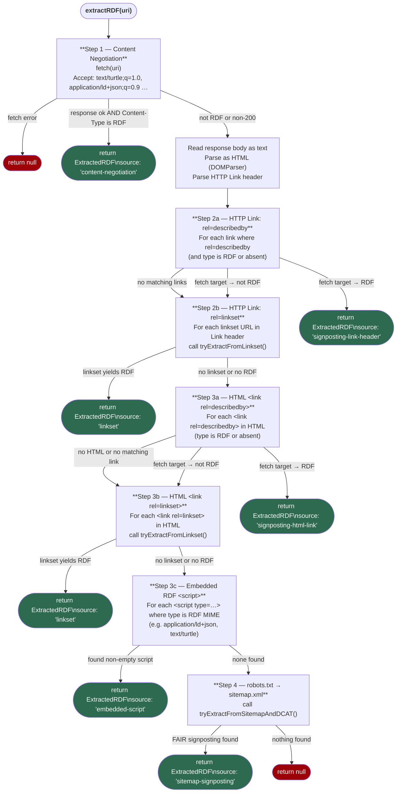
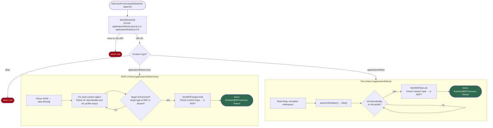

# uri_gator — RDF Extractor Documentation

## Overview

`rdf-extractor.ts` is a zero-dependency Bun/TypeScript module that retrieves RDF metadata from any URI. It follows a **cascading strategy**: each approach is tried in priority order and the first successful result is immediately returned. The module never requires external npm packages — it uses only Bun's built-in `fetch`, `URL`, and `DOMParser`.

---

## Module Architecture



### Key Types

| Type / Constant | Purpose |
|---|---|
| `ExtractedRDF` | The result object returned on success |
| `RDF_MIMES` | `Set<string>` of all recognised RDF MIME types |
| `RDF_ACCEPT` | The `Accept` header value sent during content negotiation |

#### `ExtractedRDF` interface

```typescript
interface ExtractedRDF {
  content: string;   // Raw RDF payload
  format:  string;   // MIME type (e.g. "text/turtle")
  source:            // Where it was found
    | 'content-negotiation'
    | 'signposting-link-header'
    | 'signposting-html-link'
    | 'embedded-script'
    | 'linkset'
    | 'sitemap-signposting';
  url: string;       // Final URL the RDF was fetched from
}
```

#### Supported RDF MIME types

| MIME type | Serialisation |
|---|---|
| `text/turtle` | Turtle |
| `application/ld+json` | JSON-LD |
| `application/rdf+xml` | RDF/XML |
| `application/n-triples` | N-Triples |
| `text/n3` | Notation3 |
| `application/n-quads` | N-Quads |

---

## Extraction Strategy — Full Flowchart

The diagram below captures every decision branch inside `extractRDF()`.



---

## Linkset Resolution — Detail

`tryExtractFromLinkset()` is called by Steps 2b and 3b above. It handles **two** RFC 9264 serialisations.



---

## Sitemap Fallback — Detail

`tryExtractFromSitemapAndDCAT()` is the last-resort strategy when all other approaches fail.

```mermaid
flowchart TD
    SM_START(["tryExtractFromSitemapAndDCAT(uri)"])
    SM_START --> ROBOTS["fetch {protocol}//{host}/robots.txt"]
    ROBOTS -->|error or non-200| SM_NULL([return null])
    ROBOTS -->|ok| PARSE_ROBOTS["Parse Sitemap: directives from robots.txt"]
    PARSE_ROBOTS --> FOR_SM["For each sitemapUrl …"]
    FOR_SM --> FETCH_SM["fetch(sitemapUrl)"]
    FETCH_SM -->|error or non-200| NEXT_SM[next sitemap]
    NEXT_SM --> FOR_SM
    FETCH_SM -->|ok| PARSE_XML["DOMParser.parseFromString(text, 'text/xml')"]
    PARSE_XML -->|parse error| NEXT_SM
    PARSE_XML -->|ok| FOR_URL["For each &lt;url&gt; element …"]
    FOR_URL --> CHECK_LOC{&lt;loc&gt; matches\nrequested URI?\n(trailing-slash tolerant)}
    CHECK_LOC -->|no| NEXT_URL[next &lt;url&gt;]
    NEXT_URL --> FOR_URL
    CHECK_LOC -->|yes| FOR_XLINK["For each &lt;xhtml:link&gt; in matching &lt;url&gt;"]
    FOR_XLINK --> CHECK_REL{rel=describedby?\nhref present?\ntype is RDF or absent?}
    CHECK_REL -->|no| NEXT_XLINK[next xhtml:link]
    NEXT_XLINK --> FOR_XLINK
    CHECK_REL -->|yes| FETCH_META["fetchRDF(href)\nCheck Content-Type → is RDF?"]
    FETCH_META -->|RDF confirmed| RET(["`return ExtractedRDF\nsource: 'sitemap-signposting'`"])
    FETCH_META -->|not RDF| NEXT_XLINK

    style RET fill:#2d6a4f,color:#fff
    style SM_NULL fill:#9d0208,color:#fff
```

---

## Strategy Priority Table

| Priority | Strategy | Trigger condition | `source` value |
|:---:|---|---|---|
| 1 | **Content negotiation** | Server returns RDF MIME directly | `content-negotiation` |
| 2 | **HTTP Link header — describedby** | `Link: <…>; rel="describedby"` header with RDF type | `signposting-link-header` |
| 3 | **HTTP Link header — linkset** | `Link: <…>; rel="linkset"` → resolved linkset contains RDF | `linkset` |
| 4 | **HTML link — describedby** | `<link rel="describedby">` in HTML `<head>` | `signposting-html-link` |
| 5 | **HTML link — linkset** | `<link rel="linkset">` in HTML `<head>` → resolved linkset contains RDF | `linkset` |
| 6 | **Embedded script** | `<script type="application/ld+json">` (or other RDF MIME) in HTML body | `embedded-script` |
| 7 | **Sitemap signposting** | `robots.txt` → `sitemap.xml` → `<xhtml:link rel="describedby">` in matching `<url>` entry | `sitemap-signposting` |

---

## File Structure

```
uri_gator/
├── rdf-extractor.ts      # Core module — export extractRDF(), ExtractedRDF
├── bun-globals.d.ts      # Ambient types for import.meta.main and process
├── package.json          # Bun project manifest
├── tsconfig.json         # TypeScript config (ESNext + DOM + DOM.Iterable libs)
├── DOCUMENTATION.md      # This file
└── README.md             # Project overview
```

---

## Usage

### As a library

```typescript
import { extractRDF, type ExtractedRDF } from './rdf-extractor.ts';

const result: ExtractedRDF | null = await extractRDF('https://example.org/dataset');

if (result) {
  console.log(result.source);   // e.g. 'content-negotiation'
  console.log(result.format);   // e.g. 'text/turtle'
  console.log(result.url);      // resolved URL the RDF came from
  console.log(result.content);  // raw RDF string
} else {
  console.log('No RDF found.');
}
```

### As a CLI tool

```sh
bun run rdf-extractor.ts https://example.org/dataset
```

Example output:
```
🔍 Extracting RDF from: https://example.org/dataset
✅ Found RDF (content-negotiation) from https://example.org/dataset
Format: text/turtle
Content length: 4821 chars

--- First 500 chars of RDF ---
@prefix dcat: <http://www.w3.org/ns/dcat#> .
...
```

---

## Design Decisions

### No external dependencies
The module relies exclusively on Bun built-ins (`fetch`, `URL`, `DOMParser`, `Response`). This keeps deployment simple — no `node_modules`, no `bun install` required at runtime.

### `baseMime()` helper
`Content-Type` headers can include parameters (e.g. `text/turtle; charset=utf-8`). The `baseMime()` helper strips these safely without using array indexing (which would trigger TypeScript's `noUncheckedIndexedAccess` warning).

### Graceful failure
Every network call is wrapped in `try/catch`. A failure in any step causes a fall-through to the next strategy rather than an exception — `null` is returned only when all strategies are exhausted.

### RFC 9264 linkset support
Both serialisations are supported:
- `application/linkset+json` — JSON format, checks `describedby` and `profile` relation arrays
- `application/linkset` — text format, treated as a Link header and parsed with `parseLinkHeader()`

### Trailing-slash normalisation
URI comparison in the sitemap strategy accepts `https://example.org/foo`, `https://example.org/foo/` and their reverse without requiring exact equality.
