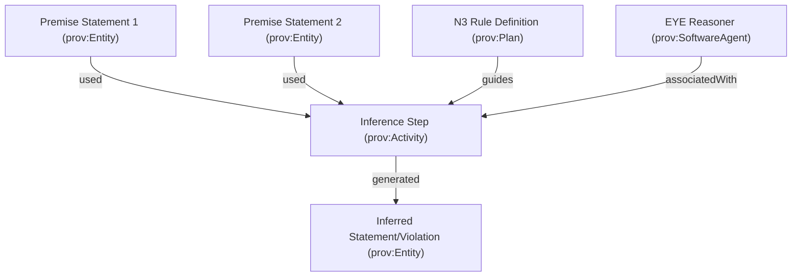

# Web Resource Extraction Provenance using W3C PROV-O and Rule-Based Reasoning

This report details how **W3C PROV-O (The PROV Ontology)** can be utilized in the `wrx` project to capture, represent, and expose the provenance of extracted RDF metadata. Additionally, it explores how to implement rule-based reasoning (based on the *Validatrr* paper) to generate provenance triples representing reasoning steps and constraint validation.

---

## 1. Modeling `wrx` Extraction Pipelines in PROV-O

The core goal of `wrx` is to extract RDF metadata from any Web URI using a cascading strategy pipeline. To make this process transparent, we can model the entire harvesting lifecycle in PROV-O, expressing:
1. **Which target resource** was interrogated.
2. **Which strategy and standard specification** successfully retrieved the metadata.
3. **What intermediate documents** (like linksets, HTML pages, or sitemaps) were traversed.
4. **Which agent** (e.g., `wrx` library or CLI) performed the action.

### 1.1 Core PROV-O Mapping Registry

We define the mapping of `wrx` core abstractions to PROV-O concepts as follows:

| `wrx` Concept | PROV-O Class | Description / Mapping |
| :--- | :--- | :--- |
| **Target Resource** | `prov:Entity` | The original URI requested by the user (e.g. `https://example.org/dataset`). |
| **Extracted RDF Payload** | `prov:Entity` | The actual Turtle/JSON-LD payload returned. Its literal value can be asserted via `prov:value`. |
| **Intermediate Document** | `prov:Entity` | Documents downloaded during harvesting, such as an HTML landing page, a Linkset JSON, or a sitemap XML. |
| **`wrx` Client/User** | `prov:Agent` | The user or service invoking the extraction. |
| **`wrx` Engine** | `prov:SoftwareAgent` | The specific version of the `wrx` software executing the pipeline. |
| **Extraction Lifecycle** | `prov:Activity` | The execution span of `extractRDF()` or `extractAllRDF()`. |
| **Strategy Execution** | `prov:Activity` | The sub-activity representing the execution of a single strategy (S1–S7). |
| **Strategy/Standard Spec** | `prov:Plan` | The specification governing the strategy (e.g. RFC 8288, RFC 9264, Sitemap Protocol). |

---

## 2. Strategy-Specific Provenance Graphs

Each of the seven cascading strategies in `wrx` has a unique extraction path. Below are the precise Turtle RDF templates that should be generated for each strategy to record their provenance.

> [!NOTE]
> We use the prefix `wrx: <https://cedricdcc.github.io/wrx/vocab.ttl#>` for project-specific terms.

### Strategy 1: Content Negotiation (RFC 7231)
*The RDF is retrieved directly from the target URI using content type negotiation.*

```turtle
@prefix prov: <http://www.w3.org/ns/prov#> .
@prefix wrx: <https://cedricdcc.github.io/wrx/vocab.ttl#> .
@prefix xsd: <http://www.w3.org/2001/XMLSchema#> .

# Target requested
<https://example.org/dataset> a prov:Entity, wrx:TargetResource .

# Extracted metadata graph
<https://example.org/dataset#extracted-rdf> a prov:Entity, wrx:ExtractedMetadata ;
    prov:value "... RDF payload ..." ;
    prov:generatedAtTime "2026-06-11T09:25:00Z"^^xsd:dateTime ;
    prov:wasGeneratedBy :conneg-activity ;
    prov:wasDerivedFrom <https://example.org/dataset> .

# Conneg Activity
:conneg-activity a prov:Activity, wrx:StrategyActivity ;
    prov:startedAtTime "2026-06-11T09:25:00Z"^^xsd:dateTime ;
    prov:endedAtTime "2026-06-11T09:25:01Z"^^xsd:dateTime ;
    prov:wasAssociatedWith :wrx-software ;
    prov:used <https://example.org/dataset> ;
    prov:qualifiedAssociation [
        a prov:Association ;
        prov:agent :wrx-software ;
        prov:hadPlan :rfc7231-plan
    ] .

:wrx-software a prov:SoftwareAgent ;
    rdfs:label "wrx.js library v1.0.0" .

:rfc7231-plan a prov:Plan ;
    rdfs:label "RFC 7231 Content Negotiation Strategy" ;
    rdfs:seeAlso <https://www.rfc-editor.org/rfc/rfc7231.html> .
```

### Strategy 2 & 4: HTTP & HTML Signposting (RFC 8288 / FAIR Signposting)
*The target document points to a separate metadata document via a `rel="describedby"` or `rel="profile"` link.*

```turtle
# Target requested
<https://example.org/resource> a prov:Entity .

# Intermediate HTML or landing page response
<https://example.org/resource#landing-page> a prov:Entity ;
    prov:wasDerivedFrom <https://example.org/resource> .

# The metadata document pointed to by the signposting link
<https://example.org/metadata.ttl> a prov:Entity ;
    prov:wasGeneratedBy :fetch-metadata-activity ;
    prov:wasDerivedFrom <https://example.org/resource#landing-page> .

# The final harvested representation
<https://example.org/resource#extracted-rdf> a prov:Entity, wrx:ExtractedMetadata ;
    prov:value "... Turtle Content ..." ;
    prov:wasDerivedFrom <https://example.org/metadata.ttl> ;
    prov:qualifiedDerivation [
        a prov:Derivation ;
        prov:entity <https://example.org/resource#landing-page> ;
        prov:hadActivity :signposting-activity ;
        prov:hadPlan :rfc8288-plan
    ] .

:signposting-activity a prov:Activity ;
    prov:wasAssociatedWith :wrx-software ;
    prov:used <https://example.org/resource#landing-page> .

:rfc8288-plan a prov:Plan ;
    rdfs:label "RFC 8288 Web Linking Signposting" ;
    rdfs:seeAlso <https://www.rfc-editor.org/rfc/rfc8288.html> .
```

### Strategy 3 & 5: Linkset Resolution (RFC 9264)
*The target points to a Linkset JSON/text document, which contains link anchors pointing to metadata.*

```turtle
# The requested URI
<https://example.org/resource> a prov:Entity .

# Linkset document (retrieved via rel=linkset)
<https://example.org/linkset.json> a prov:Entity ;
    prov:wasDerivedFrom <https://example.org/resource> .

# Metadata target described inside the linkset
<https://example.org/metadata.jsonld> a prov:Entity ;
    prov:wasDerivedFrom <https://example.org/linkset.json> .

# Harvester output
<https://example.org/resource#extracted-rdf> a prov:Entity, wrx:ExtractedMetadata ;
    prov:wasDerivedFrom <https://example.org/metadata.jsonld> ;
    prov:qualifiedDerivation [
        a prov:Derivation ;
        prov:entity <https://example.org/linkset.json> ;
        prov:hadActivity :linkset-resolution-activity ;
        prov:hadPlan :rfc9264-plan
    ] .

:linkset-resolution-activity a prov:Activity ;
    prov:wasAssociatedWith :wrx-software ;
    prov:used <https://example.org/linkset.json> .

:rfc9264-plan a prov:Plan ;
    rdfs:label "RFC 9264 Linkset Strategy" ;
    rdfs:seeAlso <https://www.rfc-editor.org/rfc/rfc9264.html> .
```

### Strategy 6: Embedded Script
*The RDF (typically JSON-LD) is parsed directly out of a `<script>` tag inside the HTML document.*

```turtle
<https://example.org/resource> a prov:Entity .

# Landing page HTML containing the script
<https://example.org/resource#html-document> a prov:Entity ;
    prov:wasDerivedFrom <https://example.org/resource> .

# Extracted RDF
<https://example.org/resource#extracted-rdf> a prov:Entity, wrx:ExtractedMetadata ;
    prov:wasDerivedFrom <https://example.org/resource#html-document> ;
    prov:qualifiedDerivation [
        a prov:Derivation ;
        prov:entity <https://example.org/resource#html-document> ;
        prov:hadActivity :embedded-extraction-activity ;
        prov:hadPlan :embedded-script-plan
    ] .

:embedded-extraction-activity a prov:Activity ;
    prov:wasAssociatedWith :wrx-software ;
    prov:used <https://example.org/resource#html-document> .

:embedded-script-plan a prov:Plan ;
    rdfs:label "HTML Embedded Script extraction strategy" .
```

### Strategy 7: Sitemap / ResourceSync Signposting
*The path uses `robots.txt` to find a `sitemap.xml`, searches for a matching `<url>` node, and extracts `<xhtml:link>` elements.*

```turtle
<https://example.org/resource> a prov:Entity .

# Robots.txt file
<https://example.org/robots.txt> a prov:Entity ;
    prov:wasDerivedFrom <https://example.org/resource> .

# Sitemap XML file
<https://example.org/sitemap.xml> a prov:Entity ;
    prov:wasDerivedFrom <https://example.org/robots.txt> .

# Extracted RDF
<https://example.org/resource#extracted-rdf> a prov:Entity, wrx:ExtractedMetadata ;
    prov:wasDerivedFrom <https://example.org/sitemap.xml> ;
    prov:qualifiedDerivation [
        a prov:Derivation ;
        prov:entity <https://example.org/sitemap.xml> ;
        prov:hadActivity :sitemap-extraction-activity ;
        prov:hadPlan :sitemap-protocol-plan
    ] .

:sitemap-extraction-activity a prov:Activity ;
    prov:wasAssociatedWith :wrx-software ;
    prov:used <https://example.org/sitemap.xml> , <https://example.org/robots.txt> .

:sitemap-protocol-plan a prov:Plan ;
    rdfs:label "Sitemap XML Metadata Signposting Strategy" ;
    rdfs:seeAlso <http://sitemaps.org/> .
```

---

## 3. Rule-Based Reasoning Provenance (Validatrr Context)

In the rule-based validation framework presented in the paper (e.g., *Validatrr* using **N3Logic** and the **EYE reasoner**), the validator executes multiple sets of rules (Inferencing, Constraint translation, Validation, and Report rules) in a single reasoner run. The reasoner can generate a logical proof detailing exactly which rules were triggered by which premise facts to produce a violation or an inferred triple.

### 3.1 Logical Proof Mapping to PROV-O

We can represent this reasoning provenance using PROV-O by translating the reasoner's proof structure. 

We identify the following conceptual mapping:
- **Premise Triples / Facts**: Represented as `rdf:Statement`s, which are subclasses of `prov:Entity`.
- **Inferred Triple / Violation**: Also represented as an `rdf:Statement` entity.
- **Rule Execution**: Represented as a `prov:Activity` (subclass `wrx:InferenceActivity`).
- **N3 Rule definition**: Represented as a `prov:Plan`.
- **Reasoner (EYE)**: Represented as a `prov:SoftwareAgent`.



### 3.2 Translating Ghent EYE Proofs (`r:Inference` / `r:gives`) to PROV-O

The EYE reasoner outputs nested proof structures using the Ghent proof ontology (`r:` prefix). We can write **N3 rules** that automatically translate these proofs into standardized W3C PROV-O triples.

```n3
# N3 Translation Rules: Ghent Proof Ont. -> W3C PROV-O
@prefix r: <http://www.w3.org/2000/10/swap/reason#> .
@prefix prov: <http://www.w3.org/ns/prov#> .
@prefix rdf: <http://www.w3.org/1999/02/22-rdf-syntax-ns#> .

# Rule 1: Map basic Facts to PROV-O Entities
{
    ?F a r:Fact .
} => {
    ?F a prov:Entity .
}

# Rule 2: Map Inference steps to Activities and generated graphs
{
    ?I a r:Inference .
    ?I r:gives ?G .
} => {
    ?I a prov:Activity .
    ?G a prov:Entity ;
       prov:wasGeneratedBy ?I .
}

# Rule 3: Map evidence linkages (premises) to usage and derivation
{
    ?I a r:Inference .
    ?I r:evidence ?List .
    ?List rdf:first ?Premise .
    ?Premise r:gives ?PremiseGraph .
    ?I r:gives ?ConclusionGraph .
} => {
    ?I prov:used ?PremiseGraph .
    ?ConclusionGraph prov:wasDerivedFrom ?PremiseGraph ;
        prov:qualifiedDerivation [
            a prov:Derivation ;
            prov:entity ?PremiseGraph ;
            prov:hadActivity ?I
        ] .
}
```

### 3.3 Explicit Provenance-Asserting Inference Rules

Alternatively, we can write our inference and validation rules to **explicitly assert PROV-O triples during execution**, eliminating the need for post-processing proof logs.

#### Example: RDFS Domain Inference Rule with PROV-O

```n3
# RDFS Domain rule that outputs both the inference and its PROV-O record
{
    ?P rdfs:domain ?C .
    ?X ?P ?Y .
    
    # Establish identifiers for statements & activities
    ( ?P rdfs:domain ?C ) log:uri ?premise1 .
    ( ?X ?P ?Y ) log:uri ?premise2 .
    ( ?X rdf:type ?C ) log:uri ?conclusion .
} => {
    # 1. Assert the inferred fact
    ?X a ?C .
    
    # 2. Assert W3C PROV-O provenance for the fact
    ?conclusion a prov:Entity, rdf:Statement ;
        rdf:subject ?X ;
        rdf:predicate rdf:type ;
        rdf:object ?C ;
        prov:wasGeneratedBy :rdfs-domain-activity ;
        prov:qualifiedDerivation [
            a prov:Derivation ;
            prov:entity ?premise1 ;
            prov:entity ?premise2 ;
            prov:hadPlan :rdfs-domain-rule ;
            prov:hadActivity :rdfs-domain-activity
        ] .
}
```

#### Example: Validation Constraint Violation Rule with PROV-O

```n3
# Validation rule mapping cardinality check violation to PROV-O
{
    ?constraint a rdfcv:SimpleConstraint ;
        rdfcv:constrainingElement :exact-cardinality ;
        rdfcv:contextClass ?Class ;
        rdfcv:leftProperties ?Prop ;
        rdfcv:constrainingValue ?ExpectedVal .
    ?X a ?Class .
    
    # Collect matching resources
    _:list e:findall (?O { ?X ?Prop ?O }) .
    _:list e:length ?Len .
    ?Len math:notEqualTo ?ExpectedVal .
    
    # Statement URIs
    ( ?X a ?Class ) log:uri ?premiseSubject .
    ?constraint log:uri ?premiseConstraint .
    
    # Generate violation node
    ( _:v a :constraintViolation ) log:uri ?violationNode .
} => {
    # 1. Assert the violation entity
    _:v a :constraintViolation ;
        :violatedConstraint ?constraint ;
        :instance ?X ;
        :property ?Prop .
        
    # 2. Assert PROV-O provenance of the violation
    ?violationNode a prov:Entity ;
        prov:wasGeneratedBy :shacl-validation-run ;
        prov:qualifiedDerivation [
            a prov:Derivation ;
            prov:entity ?premiseSubject ;
            prov:entity ?premiseConstraint ;
            prov:hadPlan :cardinality-validation-rule ;
            prov:hadActivity :shacl-validation-run
        ] .
}
```

---

## 4. Proposed Implementation Architecture for `wrx`

To introduce W3C PROV-O support into the `wrx` project, we should implement a new core harvester capability.

### 4.1 CLI Interface: `--provenance` Flag

We should add a new flag `--provenance` (or `-p`) to the CLI runner inside `src/cli/args.ts` and `src/cli/output.ts`. 

- When run as `bun run wrx.js --provenance https://example.org/dataset`, it will append a PROV-O provenance graph to the output, or output it as a separate file depending on configuration.
- If in `--all` mode, the provenance graph will include all strategies tried, showing which ones failed (using `prov:wasInvalidatedBy` or recording failed activities with `prov:invalidatedAtTime` or conneg results as alternate entities).

### 4.2 Integration in `StrategyContext` & `StrategyTraceStep`

The strategy context `StrategyContext` (defined in `src/strategies/strategy-interface.ts`) should be updated to carry:
- `startTime`: Timestamp when the extraction starts.
- `activities`: A list of strategy run traces.
- `fetchTrace`: A registry of URLs crawled, their HTTP response headers (e.g. content-type, link headers), and character counts.

This metadata can be formatted directly into PROV-O RDF triples when serialization is requested.

### 4.3 Provenance Serialization Formats

The generated provenance triples can be serialized to:
1. **JSON-LD**: Highly compatible with modern web tools and easily parsed in JS/TS.
2. **Turtle**: Standard readable format for semantic web inspection.
